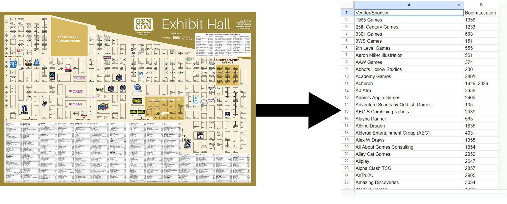

<a name="readme-top"></a>
<div align="center">

# Exhibitor Hall

</div>


<div align="center">

</div>

This script takes the Gen Con Exhibitor maps, extracts the vendor/booth number, then adds the data to a Google sheet with each map as a new tab.
<br /><br />


<details>
<summary>
Table of Contents
</summary>

- [About The Project](#about-the-project)
  - [Built With](#built-with)
- [Getting Started](#getting-started)
  - [Prerequisites](#prerequisites)
  - [Installation](#installation)
- [Usage](#usage)
- [Roadmap](#roadmap)

</details>

## About The Project
This project was designed to take the vendor and their associated booth numbers from the Exhibit Hall map and put them into a Google Sheet. Currently, Gen Con does not have a method to filter/export for specific vendors or booth easily and this script was designed to make it easier. 

> **Note:** At this moment, the script does **not** support the sponsors listed, but the feature is coming.
<p align="right">(<a href="#readme-top">back to top</a>)</p>


### Built With
<div align="center">


</div>
<p align="right">(<a href="#readme-top">back to top</a>)</p>

## Getting Started
To get a local copy up and running see the following steps. 

### Prerequisites
In order to use the script, Python must be installed. 
* Python

### Installation
1. Clone the repo
   ```sh
   git clone https://github.com/mriffey1/vendor-hall-exhibitors.git
   ```
2. Generate a service account key json at <a href="https://console.cloud.google.com/">Google Cloud Console</a>
3. Save the json file as **sheet.json**
4. Install required packages
   ```sh
   pip install -r requirements.txt
   ```
5. Rename the **.env-sample** to **.env**
6. In the .env file, update **MAIN_FOLDER_PATH** with the directory's path
7. Also update the link to **GOOGLE_WORKBOOK** that you wish to put the data in
8. Ensure you have given the service account access to the spreadsheet by sharing and giving the email address associated with the service account, Edit access

<p align="right">(<a href="#readme-top">back to top</a>)</p>


## Usage
1. To run the script, navigate to the directory with vendor_hall.py and use the following terminal command
   ```sh
   python vendor_hall.py
   ```

<p align="right">(<a href="#readme-top">back to top</a>)</p>


## Features
- [ ] Adding Sponsor names and booth locations
- [ ] Creating option for Google Sheets or Excel file
<p align="right">(<a href="#readme-top">back to top</a>)</p>

